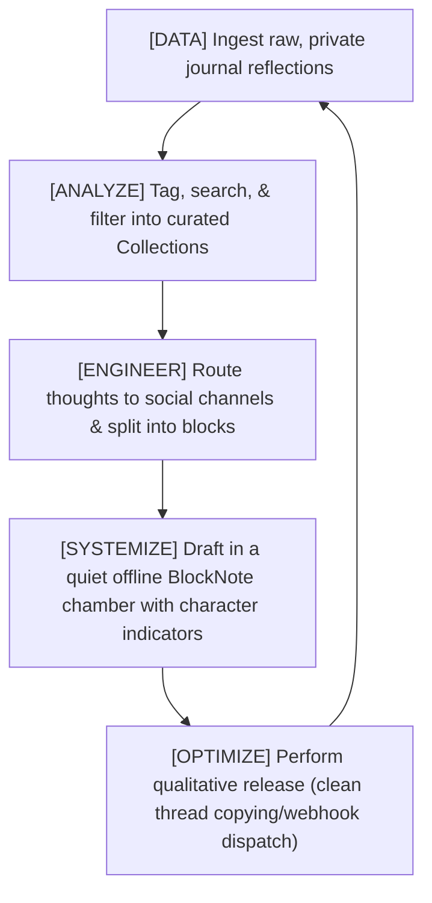

# Curation to Distribution: The Social Curation Engine Expansion

This document presents the philosophical thesis and technical design blueprint for extending the **Journal-to-Penpal Pipeline** into a **Journal-to-Social Curation Engine**.

Rather than building an automated, dopamine-driven social publishing bot, this expansion directly extends your **Experience Engine** philosophy. It treats social media channels not as attention-grabbers, but as **distant public penpals** who deserve highly curated, synthesised correspondence rather than rapid algorithmic noise.

---

## Part 1: Philosophical Alignment

### 1. Reclaiming Autonomy from the "Attention Engines"

Traditional social media networks operate under the same capitalistic mechanics as music streaming algorithms: **Novelty wins, and content has an extremely short lifetime value.** Their algorithms force creators onto a content treadmill where they must constantly feed the dopamine loop at the expense of intellectual depth.

By extending this pipeline, you create a buffer of absolute autonomy:

- **The Inward Writing Chamber**: You do not write inside a feed with blinking notifications, advertisements, and metric counts. You write inside a quiet, local-first writing chamber (our BlockNote editor).
- **Active Curation over Algorithmic Shuffling**: You crawl your raw journal data, curating thoughts into structured playlists (Curation Collections). You analyze and synthesize them before sharing, prioritizing _qualitativeness_ over passive engagement metrics.
- **Art on the Wall vs. Art in the Attic**: Automating spam bots is the social equivalent of putting art in the attic. Actively drafting a structured thread or newsletter post is hanging your art on the wall—it is the deliberate release of qualitative value.

### 2. The Social DAESO Loop

We map the distribution pipeline directly to your self-reinforcing **DAESO Loop**:



---

## Part 2: Technical Design & Blueprints

We can implement this entire expansion within the existing codebase with **zero breaking changes** to the traditional penpal database schema.

### 1. Database Model Expansion

Since IndexedDB is schema-free for non-indexed fields, we can attach rich channel configurations to the existing `Penpal` and `Letter` objects:

```typescript
export type PenpalType = "traditional" | "social_channel";
export type SocialChannelType = "twitter" | "linkedin" | "substack" | "generic";

export interface PenpalExtension {
  type: PenpalType; // "traditional" or "social_channel"
  social_config?: {
    channel: SocialChannelType;
    handle?: string;
    max_block_length: number; // e.g. 280 for Twitter, 3000 for LinkedIn
    thread_separator: string; // e.g. "\n\n---\n\n" or sequential "1/"
    webhook_url?: string; // Dispatch endpoint (e.g. self-hosted n8n or Typefully v2 API)
    auth_token?: string; // Optional headers (stored locally in DB, never exposed to cloud)
  };
}
```

---

## Part 3: User Interface & Visual Extensions

We will enrich the workstation with three key visual layers:

### 1. Dual-Personality Sidebar (Penpals vs. Channels)

The penpal panel will feature a clean segmented tab switcher: **"Penpals"** and **"Channels"**, using harmony-curated semantic icons.

- **Traditional Penpals**: Retains the quiet, postal aesthetics (Mail, map pins, country badges).
- **Social Channels**: Introduces quiet, modern distribution icons (GitBranch, Twitter/X indicators, Globe, Substack icons) mapped to your active distribution streams.

```
+------------------------------------+
|  [ Traditional (3) ]  [ Social (2) ]|
+------------------------------------+
| • Twitter Thread Builder           |
| • Substack Newsletter Draft        |
+------------------------------------+
```

### 2. The Live Thread Splitter & Character Gauge

When writing a draft for a social channel (e.g. Twitter), the BlockNote editor will dynamically adjust:

- We can introduce a custom component block or editor view wrapper that displays a **visual progress ring** or character counter in the margin of each block.
- If a block (e.g. a paragraph representing a single tweet) exceeds `280` characters, the text color changes or displays a subtle crimson dot indicator in the margin, warning you to split or condense the thought before export.

### 3. Qualitative Release Actions (Export Panel)

We will expand the letter export component with custom actions:

- **Copy Tweet Thread**: Automatically parses the blocks, strips HTML, splits them by the configured block limits, prepends sequential thread markers (`1/`, `2/`, `n/`), and copies them to the clipboard.
- **Blog/Substack Markdown Export**: Translates custom routed blocks into clean, publishing-ready Markdown.

---

## Part 4: Research Insights — How Modern Schedulers & Routers Work

Web research of modern social automation architectures (such as **Buffer API**, **Typefully API v2**, and **n8n Webhook engines**) reveals two distinct integration pathways:

1.  **Direct Curation Ingestion APIs (e.g. Typefully v2)**:
    Modern writers use Typefully's structured API. Ingesting content programmatically is done via `POST /v2/drafts` with a payload representing a thread:

    ```json
    {
      "thread": [
        { "content": "First tweet/block content #autonomy" },
        { "content": "Second tweet/block content" }
      ],
      "tags": ["philosophy", "curation"],
      "schedule_date": null
    }
    ```

    This triggers real-time queue synchronization, updating drafts dynamically in their posting schedule.

2.  **Self-Hosted Webhook Routers (e.g. n8n.io / Make / Zapier)**:
    For complete privacy and control, developers build self-hosted **n8n** webhook receivers. n8n dynamically parses incoming JSON envelopes without a fixed schema, allowing the developer to:
    - Validate payloads using header-based signature verification.
    - Split threads into individual items.
    - Route content programmatically to multiple targets (e.g. Mastodon, LinkedIn, Twitter, and Substack simultaneously).

---

## Part 5: The Autonomous Webhook Router Blueprint

To respect your local-first and privacy philosophy, we reject storing credentials or API tokens on a centralized, proprietary intermediate cloud.

Instead, we will build a **Universal Local Webhook Router** directly inside your application:

### 1. The Local Dispatch Mechanism

When a social thread is ready, and you click **"Release Curation"**, the React application fetches the configured webhook URL and auth token directly from your local IndexedDB, performing a direct, client-side HTTP `POST` dispatch:

```typescript
export async function dispatchCurationWebhook(
  webhookUrl: string,
  token: string | undefined,
  payload: { title: string; thread: string[]; markdown: string; tags: string[] },
): Promise<Response> {
  const headers: Record<string, string> = {
    "Content-Type": "application/json",
  };
  if (token) {
    headers["Authorization"] = `Bearer ${token}`;
  }
  return fetch(webhookUrl, {
    method: "POST",
    headers,
    body: JSON.stringify({
      event: "curation.release",
      timestamp: new Date().toISOString(),
      data: payload,
    }),
  });
}
```

### 2. Advantages of the Local Router

- **Privacy-First**: No keys are stored in a centralized cloud. Your webhook credentials live strictly in your sandboxed browser IndexedDB.
- **Ultimate Versatility**: You can point the URL to a Typefully API to queue tweets, a self-hosted n8n webhook to trigger multiple cross-posts, a local webhook inspector, or a Slack channel for private review.
- **Reactive Feedback**: The app captures the response status code and shows a beautiful, real-time toast indicating successful dispatch or specific connection errors.

---

## Part 6: Proposed Curation-to-Distribution Implementation Phases

We propose executing this expansion in three logically distinct, build-validated phases:

### Phase 1: Database & Channel Forms

- Expand type definitions inside `src/types/index.ts`.
- Upgrade `PenpalFormModal.tsx` to support toggling between **Traditional Penpal** and **Social Media Channel** modes.
- Add input forms for `webhook_url`, `auth_token`, `channel`, and `character limit`.

### Phase 2: Workstation Curation & Visual Editor Gauges

- Update `PenpalPanel.tsx` to render different icons and visual statistics depending on whether the active target is a penpal or a channel.
- Modify `LetterEditor.tsx` to read the active target's character constraints and enable the visual character limit warning lights on BlockNote blocks.

### Phase 3: Webhook Routing & Export Engines

- Implement the universal webhook dispatch client in a new service `src/services/socialRouter.ts`.
- Implement clean thread splitting and markdown translation utilities in `src/utils/serializeToPlainText.ts`.
- Update `ExportActions.tsx` to show **"Release Curation"** and **"Copy Thread"** based on the active channel context.
